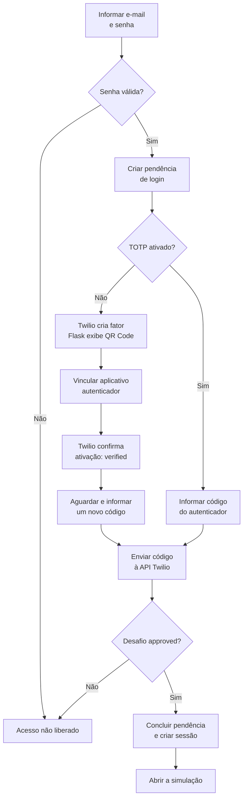

# Integração com a API Twilio Verify — SafeClick

Documentação técnica e projeto lógico da integração utilizada no login com segundo fator.

Versão de referência: branch `entrega2809`, código revisado em 27/09/2026.

## 1. Objetivo e escopo

O SafeClick utiliza a API externa Twilio Verify para verificar o segundo fator de autenticação. Essa integração está relacionada ao contexto de segurança digital do projeto e participa efetivamente da liberação do acesso.

O primeiro fator é a senha, conferida no servidor Flask por comparação com o hash `scrypt` armazenado no banco. O segundo fator é um código TOTP gerado pelo aplicativo autenticador vinculado à conta. A API Twilio valida esse código; o SafeClick decide se deve criar a sessão.

O canal implementado é TOTP. Este fluxo não utiliza envio de códigos por SMS, WhatsApp ou e-mail. O QR Code é gerado localmente pela biblioteca `qrcode`, a partir da URI retornada pela Twilio. Referência: [Verify TOTP](https://www.twilio.com/docs/verify/quickstarts/totp).

## 2. Componentes e projeto lógico

| Componente | Responsabilidade |
| --- | --- |
| Navegador | Apresenta os formulários, o QR Code e as mensagens de resultado. |
| Aplicativo autenticador | Armazena o segredo TOTP e gera os códigos para o usuário. |
| `safeclick/autenticacao.py` | Recebe os formulários e cria a sessão após a confirmação do segundo fator. |
| `safeclick/mfa.py` | Controla a configuração e confirmação do autenticador, respeitando a pendência de login. |
| `safeclick/twilio_api.py` | Encapsula as chamadas à API externa e verifica os estados retornados. |
| `safeclick/logins_db.py`, `limites.py` e `sessoes.py` | Controlam pendências, tentativas e sessões autenticadas. |
| PostgreSQL/Neon | Armazena usuários, vínculos com fatores, limites e sessões. |



O diagrama representa o caminho de sucesso da ativação inicial; erros e limites são tratados conforme a seção 6. A ativação do fator, isoladamente, não cria uma sessão autenticada. Nos acessos seguintes, o usuário reutiliza o fator já configurado.

## 3. Configuração e comunicação

O projeto declara `twilio==9.11.1` e `qrcode==8.2` em `requirements.txt`. O cliente da API é criado no servidor, com timeout HTTP configurado em 10 segundos.

| Variável de ambiente | Finalidade |
| --- | --- |
| `TWILIO_ACCOUNT_SID` | Identifica a conta utilizada pela integração. |
| `TWILIO_AUTH_TOKEN` | Credencial utilizada pelo servidor para autenticar as chamadas. |
| `TWILIO_VERIFY_SERVICE_SID` | Identifica o serviço Verify que contém os fatores. |

Na implementação atual, o SDK utiliza Account SID e Auth Token para autenticação HTTP Basic sobre HTTPS. As operações POST enviam campos de formulário; as respostas são JSON, convertidas em objetos pelo SDK. Referência: [requisições à Twilio](https://www.twilio.com/docs/usage/requests-to-twilio).

As variáveis são carregadas pela configuração Flask. O arquivo `.env` permanece local e ignorado pelo Git. A documentação não contém credenciais reais. O cadastro e o controle de sessão também dependem de `DATABASE_URL` e `SECRET_KEY`, conforme o README.

## 4. Operações consumidas da API

Base da API: `https://verify.twilio.com/v2`.

Na tabela, `P` representa `/Services/{ServiceSid}/Entities/{Identity}`. `ServiceSid` vem da configuração; `Identity` é o UUID `mfa_identidade`; `FactorSid` é o identificador do fator vinculado ao usuário.

| Operação | Método e caminho | Dados enviados e resposta utilizada |
| --- | --- | --- |
| Conferir conexão | `GET /Services/{ServiceSid}` | Consulta o serviço e apresenta seu nome no comando de diagnóstico. |
| Criar fator TOTP | `POST P/Factors` | Envia `FriendlyName=SafeClick` e `FactorType=totp`; utiliza `sid` e `binding.uri`. |
| Consultar fator | `GET P/Factors/{FactorSid}` | Consulta o estado `unverified` ou `verified`. |
| Confirmar ativação | `POST P/Factors/{FactorSid}` | Envia `AuthPayload` com o código; exige `status=verified`. |
| Verificar código de login | `POST P/Challenges` | Envia `FactorSid` e `AuthPayload`; exige `status=approved`. |
| Reiniciar configuração pendente | `DELETE P/Factors/{FactorSid}` | Remove um fator ainda não verificado antes de criar outro, respeitando os limites locais. |

Referências dos contratos: [Factor](https://www.twilio.com/docs/verify/api/factor) e [Challenge](https://www.twilio.com/docs/verify/api/challenge).

Os nomes HTTP acima correspondem a parâmetros como `friendly_name`, `factor_type`, `factor_sid` e `auth_payload` no SDK Python. A aplicação valida o código como texto de seis dígitos, preservando zeros iniciais.

Exemplos resumidos e ilustrativos das respostas utilizadas:

```json
{"status": "verified"}
```

Esse estado confirma a ativação do fator. Para concluir o login, a resposta do desafio precisa conter:

```json
{"status": "approved"}
```

## 5. Dados enviados e persistência

A integração usa o UUID do usuário, o identificador do fator e o código TOTP. A senha, seu hash, o nome e o e-mail do usuário não são enviados como campos das chamadas implementadas. O nome amigável enviado é a constante `SafeClick`.

| Dado local | Uso |
| --- | --- |
| `usuarios.mfa_identidade` | UUID utilizado como identidade externa. |
| `usuarios.mfa_fator_sid` | Identificador do fator retornado pela Twilio. |
| `usuarios.mfa_confirmado_em` | Data da confirmação do vínculo com o autenticador. |
| `logins_pendentes` | Hash do token temporário, tentativas, validade e conclusão do login. |
| `sessoes_autenticadas` | Hash do token da sessão, usuário, atividade e expiração. |

O segredo TOTP é retornado na configuração inicial para gerar o QR Code e permitir sua inclusão no aplicativo. O código atual não grava esse segredo, a URI ou o QR Code no PostgreSQL nem no cookie. O código digitado também não é persistido nessas tabelas.

## 6. Validações e tratamento de falhas

| Situação | Comportamento implementado |
| --- | --- |
| Senha incorreta | Rejeita o login, sem criar sessão autenticada. |
| Formulário ou CSRF inválido | Rejeita o envio antes da operação correspondente. |
| Resposta de ativação sem `verified` ou desafio sem `approved` | Rejeita a confirmação; mantém o acesso bloqueado. |
| Exceção HTTP da Twilio, falha de rede ou timeout | Converte a falha em erro tratado; as rotas apresentam mensagem e resposta HTTP 503, sem liberar o acesso. |
| Fator ausente na consulta, com HTTP 404 remoto | Considera o fator indisponível e não conclui o login. |
| Pendência expirada | Impede sua conclusão e solicita novo login ao revalidar a pendência. |
| Limite de tentativas atingido | Rejeita a operação com HTTP 429. |
| Configuração alterada ou fator já ativado ao solicitar novo QR Code | Rejeita a reconfiguração com HTTP 409. |

O tratamento atual não classifica individualmente todos os códigos de erro da Twilio: exceções do SDK são apresentadas como falha genérica da operação. A rejeição de uma resposta sem aprovação e uma exceção HTTP seguem caminhos diferentes no código.

Uma pendência dura cinco minutos e admite até cinco envios de código. O envio com formato válido e CSRF válido consome uma tentativa antes da chamada externa, inclusive se ela falhar. A configuração do QR Code admite três solicitações por usuário em cinco minutos; o login admite cinco envios válidos de formulário por e-mail em cinco minutos.

## 7. Criação e encerramento da sessão

Após um desafio aprovado, o servidor marca a pendência como concluída e cria a sessão autenticada. O token da sessão é armazenado como hash no banco; o navegador recebe o cookie assinado da aplicação. A sessão expira após 30 minutos de inatividade ou oito horas desde sua criação.

A saída da conta utiliza POST com proteção CSRF e remove a sessão atual do banco. A senha utiliza hash `scrypt`, não criptografia reversível. As chamadas à Twilio usam HTTPS; o servidor local de desenvolvimento usa HTTP, e o ambiente publicado requer configuração própria de HTTPS e cookie `Secure`.

## 8. Verificação e evidências

Para conferir as credenciais e o acesso ao serviço, execute na raiz do projeto:

```powershell
.\.venv\Scripts\python.exe -m flask --app safeclick verificar-twilio
```

Esse comando consulta o serviço. A demonstração funcional deve incluir:

1. Cadastro e validação das credenciais no login.
2. Configuração do autenticador por QR Code e confirmação da ativação.
3. Confirmação de um novo código e acesso à simulação.
4. Novo login com o autenticador já vinculado.
5. Rejeição de código incorreto e bloqueio de acesso antes do segundo fator.
6. Saída da conta e exigência de login ao tentar acessar uma página protegida.

Durante o desenvolvimento, foram relatados testes reais de configuração do autenticador, login, bloqueio por limite de login e saída da conta. Na revisão de 27/09/2026, 27 testes automatizados passaram em ambiente de apoio, com banco e Twilio simulados. Esses testes não estão versionados nesta branch e não representam uma nova execução contra os serviços externos.

## 9. Limites desta etapa

O login depende da disponibilidade da Twilio, do Neon e da configuração das contas utilizadas. Recuperação de senha e recuperação após perda do autenticador permanecem pendentes. A integração da página administrativa de auditoria e a validação do ambiente publicado pertencem às próximas verificações do grupo.

## 10. Referências

- [Twilio — Verify TOTP Quickstart](https://www.twilio.com/docs/verify/quickstarts/totp).
- [Twilio — Factor Resource](https://www.twilio.com/docs/verify/api/factor).
- [Twilio — Challenge Resource](https://www.twilio.com/docs/verify/api/challenge).
- [Twilio — API requests](https://www.twilio.com/docs/usage/requests-to-twilio).

Fontes consultadas em 27/09/2026. O comportamento específico do SafeClick foi conferido nos módulos citados neste documento.
